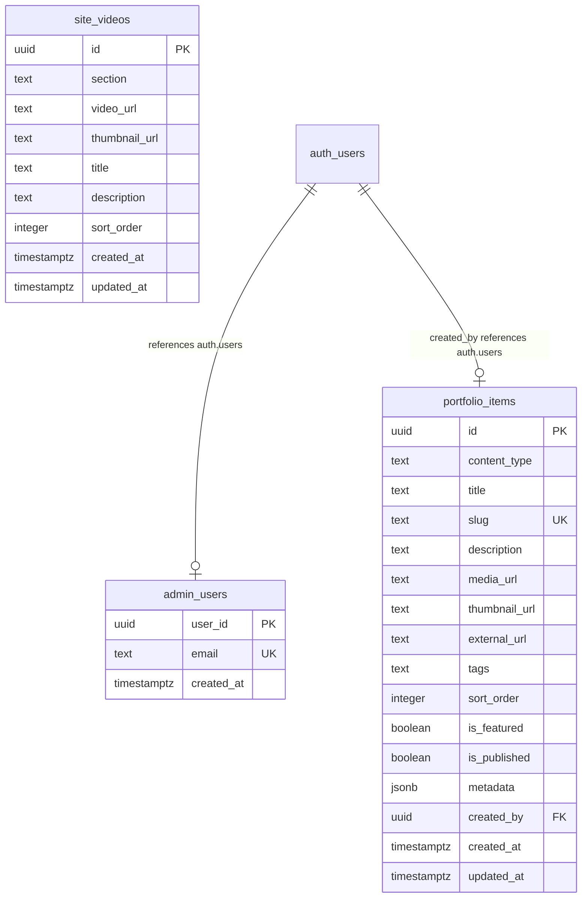

# Quantum Climb - Project Analysis

This document provides a detailed technical analysis of the **Quantum Climb - Enterprise AI Dubbing** web platform.

---

## 1. Overview & Business Domain
**Quantum Climb** is a premium, enterprise-grade AI dubbing and voice cloning platform designed for global film distribution. The platform boasts:
*   **High-fidelity voice cloning**: Recreating actors' voices across languages.
*   **Fast feedback loops**: 48-hour turnarounds on dubs.
*   **Global reach**: Dynamic media workflows, interactive neural avatars, and low-latency audio/video output.

---

## 2. Technical Stack
The application is built using a modern, performant web stack:

*   **Frontend Framework**: React 19 (TypeScript)
*   **Build Tool**: Vite v6
*   **Styling**: Tailwind CSS v4 (offering high performance and streamlined configurations)
*   **Animations**: Motion (formerly Framer Motion) for slick, hardware-accelerated micro-animations and reveal transitions
*   **Icons**: Lucide React
*   **Database & Auth Backend**: Supabase (PostgreSQL, Supabase Auth, Supabase Storage)
*   **Large File Uploads**: `tus-js-client` for resumable, chunked uploads
*   **AI Integration**: Pre-configured with `@google/genai` for future Google Gemini API integrations

---

## 3. Architecture & Project Structure
The frontend architecture follows a component-based layout driven by state-based routing.

```
d:/QUANTUM CLIMB - PROJECTS/QC WEBSITE/
├── public/                 # Static assets
├── supabase/
│   └── migrations/         # SQL migration scripts for schema & RLS rules
├── src/
│   ├── main.tsx            # Main application entry point
│   ├── App.tsx             # Root component containing state, business logic & handlers
│   ├── index.css           # Global CSS & Tailwind configuration
│   ├── lib/
│   │   └── supabase.ts     # Supabase client setup and media helpers
│   ├── components/         # Reusable layouts and visual components
│   │   ├── AppShell.tsx    # Header, footer, layout wrapper, and route switcher
│   │   ├── MediaPlayer.tsx # Custom video, audio, and YouTube player
│   │   ├── ContactModal.tsx# Inquiry contact modal
│   │   ├── Reveal.tsx      # Entry animation wrappers
│   │   └── SectionHeader.tsx
│   └── sections/           # Large landing-page segments
│       ├── HeroSections.tsx
│       ├── PlatformSections.tsx
│       ├── MarketingSections.tsx
│       ├── PortfolioSections.tsx  # Video, image, music, and site link galleries
│       ├── AdminSections.tsx      # Admin panel for item creation and file uploads
│       ├── ClosureSections.tsx
│       └── LegalSections.tsx
```

---

## 4. Database Schema & Policies
The Supabase database schema consists of three primary tables:



### Security & Row-Level Security (RLS)
The database enforces strict RLS policies to safeguard uploads and portfolio management:
*   **Anonymous Reads**: Unauthenticated users can view published portfolio items (`is_published = true`) and site videos.
*   **Admin Access**: Writing, editing, or deleting items and videos requires the user's UUID to exist in the `admin_users` table.
*   **Bootstrap Mode**: If no admin users exist yet, the first user to sign in can claim admin access (`private.bootstrap_open()`).

---

## 5. Media Upload & Storage Logic
The app contains an advanced media pipeline that handles direct-to-cloud uploads to three Supabase storage buckets:
1.  `portfolio-images` (max 50 MB)
2.  `portfolio-audio` (max 150 MB)
3.  `portfolio-videos` (max 500 MB)

### Resumable Upload Gateway
In [App.tsx](file:///d:/QUANTUM%20CLIMB%20-%20PROJECTS/QC%20WEBSITE/src/App.tsx), uploads are split by size:
*   **Small Files (≤ 6 MB)**: Uploaded using standard multipart `XMLHttpRequest` or Supabase SDK `upload()`.
*   **Large Files (> 6 MB)**: Processed via the **TUS Resumable Protocol** using `tus-js-client`. This ensures chunked uploads that can recover gracefully from network interruptions, which is essential for high-definition video files up to 500MB.

---

## 6. Development Workflow
The workspace includes:
*   `npm run dev`: Starts the Vite development server (port 3000, host 0.0.0.0).
*   `npm run build`: Bundles the React application for production.
*   `npm run lint`: Typescript verification via `tsc --noEmit`.
